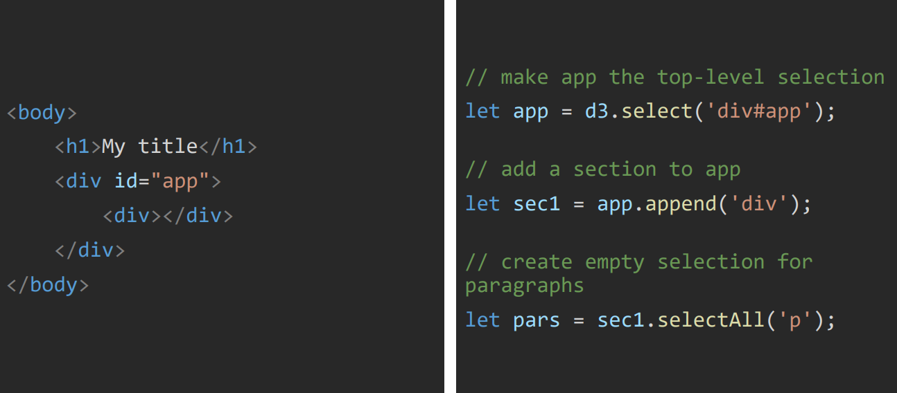
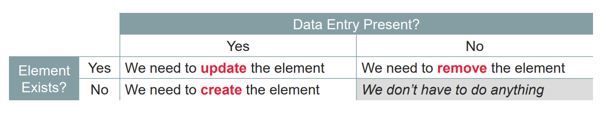
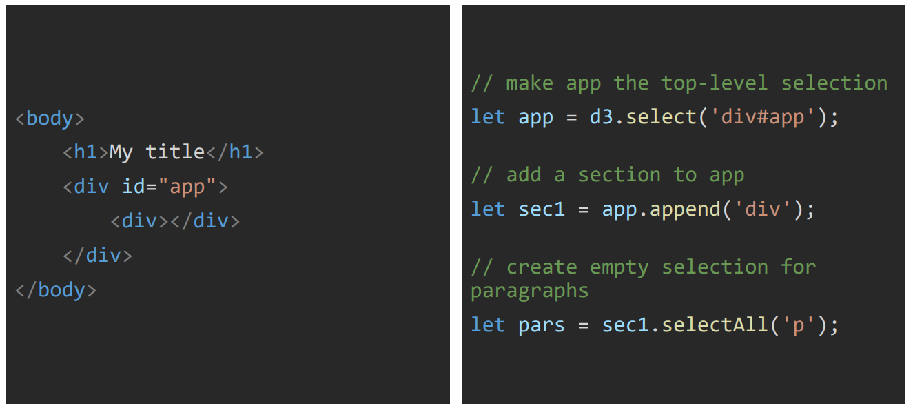
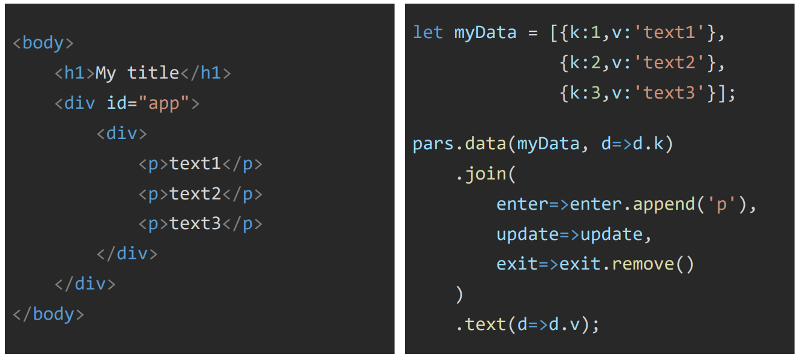
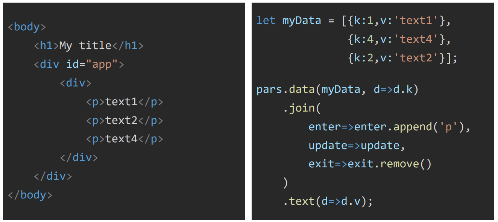
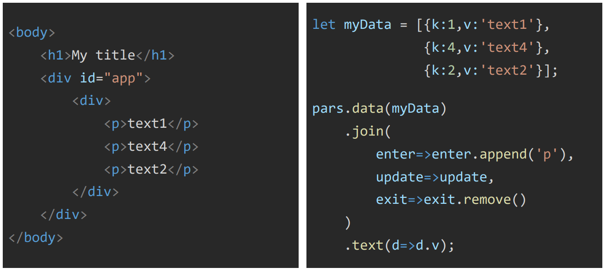
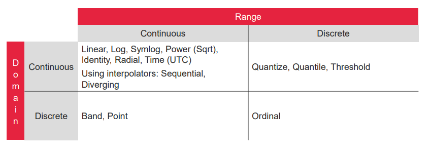
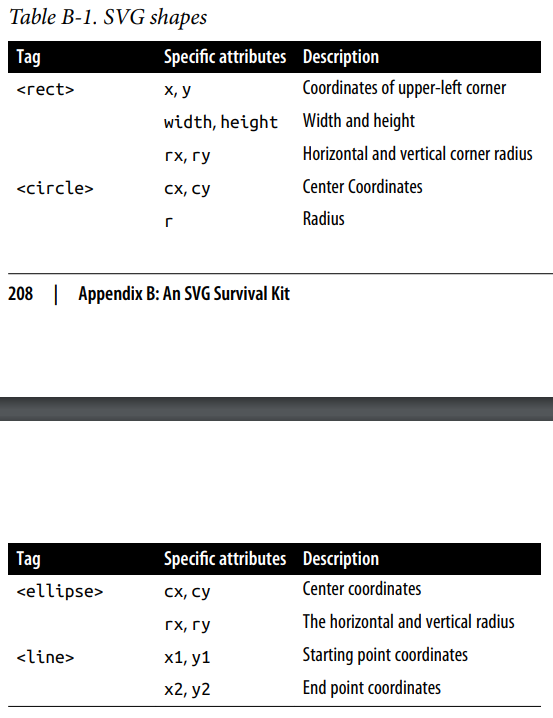
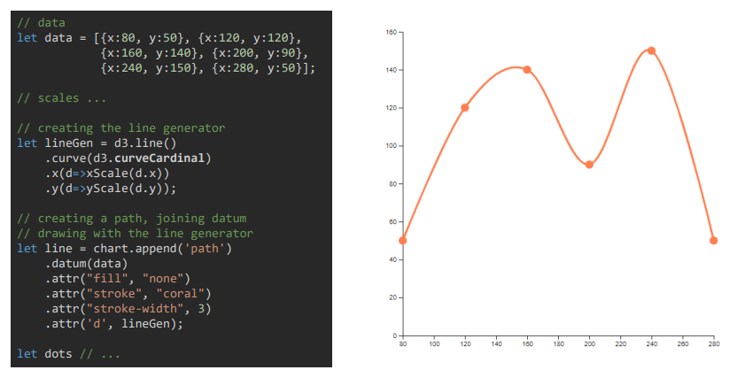
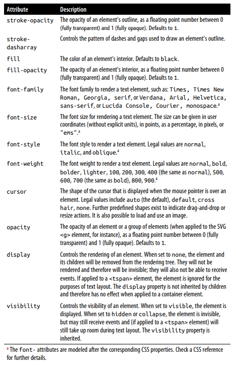

# 
 D3 for data Visualisation  Data-Driven Documents

* DOM elements are accessible in HTML (tags), CSS (selectors) and
JavaScript (nodes)  
* A D3 Selection is a wrapper object surrounding DOM nodes in JavaScript  

**Prepare your data** - Ensure data is <u>**properly ordered**</u>. An unordered dataset will create messy line charts.  
* Do this with `d3.sort(ds, attribute_to_sort_by)` method  
* With Some charts (such as bubble chart), can specify the order elements are processed to determine which elements will lie on top and which will lie behind  

---  

#### D3 Dataset functions  

To explore and refine datasets  

##### Statistics:  
* Each method takes an iterable as first parameter, and an optional accessor function  
`d3.min(iterable)` - returns minimum value  
`d3.max(iterable)` - returns maximum value  
`d3.extent(iterable)` - returns minimum and maximum value in iterable using natural order, undefined if array empty  
`d3.mean(iterable)` - returns mean (average of all values)  
`d3.mode(iterable)` - returns mode (most common value)  
`d3.median(iterable)` - returns median (middel value when in order)  
`d3.variance(iterable)` - average degree to which each point differs from the mean  
`d3.deviation(iterable)` - spread of a group of values from the mean (square root of variance)  
`d3.quantile(iterable, percentile)` - 
 
---  

#### CSS Selectors  

[CSS Selectors reference](https://developer.mozilla.org/en-US/docs/Web/CSS/CSS_Selectors)  

  
  
* Selector combinations are less commonly used when working with D3, because nested selections provide a more idiomatic alternative  
e.g., `d3.selectAll( "p" ).selectAll( "b" )`  

---  

Many D3 **functions** use the following idiom:  
* When called **with** approrpriate arguments, these functions act as *<u>setters</u>* - setting the corresponding property to the supplied value. Many D3 setters can take an **accessor function** as an argument, which is expected to return a value that will be used to set the property in question  
* When called **without** arguments, these functions act as *<u>getters</u>* - returning the current value of the property  
* To entirely <u>*remove*</u> a property, call the appropriate setter while supplying **null** as argument  

---  

##### NOTE - 
* `d` generally used to denote "current thing" in anonymous functions. It is usually an individual data point bound to a DOM element; when working with arrays, d is an array element (as in `ds.map( d => +d )` )  
* Data sets are usually denoted `data` or `ds`  

   

* Two methods can **create selections**:  
  `d3.select(selector)` - selection with the first element matching selector  
  `d3.selectAll(selector)` - selection of all elements matching selector
* If nothing is matched, an empty selection is created  
  
  

 

* Can be **chained**:  
`mySelection.selectAll(selector)` - access descendants of the DOM node  
`mySelection.append(tag)` - lets you add a direct child to each elements
of your selection, and returns these children as a new selection  
`mySelection.filter(selector)` - similar to selectAll, the selector can be a CSS selector string or an accessor function, if accessor, then must return a Boolean that indicates wheather the current node should be retained in the selection or not  
* Selection methods nest when chained: any **subsequent selection action will only act on the results of the previous one**  

 

* Making a selection:
  

 

* **Binding** data to elements:  
`mySelection.data(myData, key)` - method for binding myData to
elements of mySelection. `key` is an accessor to uniquely match data items to DOM elements.
  * Default key is the data indices  
  * Accessor functions essentially declare how to reach part of data objects, 
e.g., &emsp; d => d.k  

 

* **Joining** elements:  
  * Once DOM elements are bound to data entries, we have four possibilities:  
  
`mySelection.join(…)` - method that gives us access to these three
sub-selections:  
  * **enter selection**, for elements to add - DOM elements are created for any unmatched data items  
  * **update selection**, for elements to change - DOM elements are styled based on the data bound to them  
  * **exit selection**, for elements to remove - surplus DOM elements (that have no data bound to them) are removed from the graph  

  

  

   

 

  * **returns** the fully updated selection (enter+update)  
  
  
Note the accessor function in the 'data' function  
By **key value**:  
  
Without accessor function, takes **objects as passed**:  
  
Adding missing elements and removing extra ones is a **default behaviour**  
`mySelection.join(tag)` - shorthand for doing so (refers to the
element that need appending)  

  

#### General Update Pattern  

When updating a graph because data is only becoming available over time or because the graph must respond to user input. Follow this sequence of steps:  
1. **Bind new data** to an existing selection of elements  
2. **Remove any surplus** items that do not have matching data associated anymore (the `exit()` selection)  
3. **Create and configure all items** associated with data points **that did not exist before** (the `enter()` selection)  
4. **Merge the remaining items from the original** selection with the newly created items from the `enter()` selection  
5. **Update all items** in the combined selection based on the current values of the bound data set  

---  

#### Operating on Elements in a Selection  
* **Manipulate** aspects of the individual DOM elements contained in the selection  
* All function arguments are optional (as always in JavaScript). The functions in the table below can be used to **set, get, or clear an attribute** (or property, or style), depending on the value argument:  
  * If **no value is supplied**, the function **returns the current value** for the first nonnull element in the selection  
  * If a **null value is supplied**, the **attribute (or property) is removed** from the element  
  * If a **constant value is supplied and not null**, the **attribute (or property) is set** to the supplied value  
  * If a **function is supplied**, it is **evaluated for every element in the selection**  

  
  

#### Operating on Selections Themselves  
* Operates on entire selection (adds, removes, reorders elements)  

  
  

---  

#### D3 Scale  

[D3 Scale Documentation](https://github.com/d3/d3-scale)  

* Module that provides a set of constructors for scale functions (Scales data to pixels)  
* Each scale function maps from an **input domain** to an **output range**  
  
General structionr:  
`d3.scale(domain, range);`  
* Update seperately later:
&emsp;`scale.domain(newDomain);`  
&emsp;`scale.range(newRange);`  
* For:
  * **continiuouse values** `domain` and `range` are an array of two elements, the minimum and maximum values  
  * **descrete values** `domain` and `range` are an array of all possible values  
* Returns a scale function which can be used to get the value in the range given a value in the domain `scale(domainValue) -> rangeValue`  

   

**Linear Scale:**  
  
**Square Root Scale:**  
  
**Log Scale:**  
  
**Band Scale:**  
  
**Point Scale:**  
  

   

---  

#### D3 Axis  

[D3 Axis Documentation](https://github.com/d3/d3-axis)  

* Module that lets you **render the scales** created by D3 scale 
* Regardless of orientation, **axes are always rendered at the origin**. To change the position of the axis with respect to the chart, specify a transform attribute on the containing element.
&emsp;&emsp;`.attr("transform", "translate(0,30)")` (to move axis to coordinates 0,30)  
* Because the visual axis component consists of many individual SVG elements (for tick marks and labels), it should **always be created inside its own `<g>` container** - Styles and transformations applied to this parent element are inherited by all parts of the axis  

First, create an axis generator:  
`let axisGen = d3.axis(scale);`  
Then call the generator on a selection (axis DOM elements will be automatically appended):  
`selection.call(axisGen);`  

   

**Axis Bottom:**  
  
**Axis Right:**  
  
**Axis Left:**  
  
**Axis Top:**  
  

##### Customise axes:  

`axis.tickValues(valuesArray);`  
* Sets values of ticks (axis interval labels)  

`axis.tickFormat(formatter);`  
* Format the tick values to be readable (e.g. with dates, large numbers, or numbers with units)  

`axis.ticks(count);`  
* Set the number of ticks to render (with regular intervales)  

`axis.ticks(interval);`  
* Set the time intervals between ticks on a time axis  

---  

#### Array Operations  

  

---  

#### SVG - Scalable Vector Graphics  
* Markup language (XML based) for 2D vector graphics  
* Manipulated in JavaScript  
* Styled in CSS  
* HTML is for text and input, SVG is for graphics  

   

* 'svg' - always the top level element of the graphic  
  * Has width and height attributes to define the viewport  
* 'g' (for group) - aggregator element  
  * Useful to apply transformations to a set of elements  

  

#### SVG Transformations  

* Can apply a transform to any SVG element by setting the elements `transform` **attribute**  
* **Or** human-readable format:
&emsp; `scale( fx, fy )` - if fy is ommited, fx is ued for both  
&emsp; `rotate( phi, x, y )` - rotate around (x,y), (0,0) if missing  
&emsp; `translate( dx, dy )` - moves object  
  * Can build these up as:  
&emsp;&emsp; `<rect transform="translate(10,20) scale(2.0) rotate(30)" />`  
&emsp;&emsp;**NOTE - always applied <u>right to left</u>**  
* Remember y axis **<u>points down</u>**  
* Scaling and rotating objects that are **not located at the origin has <u>side effects</u>**, also translation followed by scaling scales the translation:  
  

**<u>Follow workflow:</u>**  
1. Create objects only at the origin  
2. Apply any desired scalings and rotations while the object is still at the origin  
3. Only then move (translate) the object to its intended location  

Use `<g>` elements to apply transformations to all children. With this, can assemble a complex graphical object from its constitutents, and then move the entire aggregate to its desired location at once  

  

#### Simple shapes  
* SVG provides explicit tags for a set of predefined simple shapes.
Each shape has a set of specific attributes that control size and posi‐
tion:  
  

#### Complex shapes  
**Path**:
* SVG provides a special element `path`, it only needs one attribute `d` (for draw) - value of `d` is essentially a list of commands and parameters to:  
  * Move to given coordinates  
  * Draw a line  
  * Draw a Benzier Curve  
  * Draw an elliptical arc curve  
* Downside is need to calculate value of all these parameters. Instead **consider following D3 modules**  

**D3 modules for complex shapes**  
* Data generators - Converts numbers to angles (donut chart), or cumulative numbers (staked bar chart)  
* Shape generators - Functions turning data into complex SVG paths (arcs, curves, areas, links, symbols)  
* Curve interpolators - Estimates a continuous range of values between fixed discrete points (linear, cardinal, step)  
  
  

#### Data Generators

**Pie Generator**:  

`d3.pie` module  
* Calculates angles necessary to draw a pie chart, or donut chart  
* If plan to use in conjunction with `arc generator`, should **specify angles in radians (0 at -y(12 o'clock) and positive angles proceeding clockwise)

[Properties](https://github.com/d3/d3-shape/blob/v3.1.0/README.md#pies)  

  
  

**Stack Generator**:  

`d3.stack` module  
* Calculates the cumulative values of layers, in order to create stacked displays   

[Properties](https://github.com/d3/d3-shape/blob/v3.1.0/README.md#stacks)  

 

#### Shape Generators  

**Line Generator**:  
`d3.line` module  
* Computes the path of a line going through several points  
* Main properties concern:  
  * Access and transformation of x and y values  
  * Use of a curve interpolator  
  
[Properties](https://github.com/d3/d3-shape/blob/v3.1.0/README.md#lines)  

##### Line Generator Methods:   

  
 

**Arc Generator**:  
`d3.arc` module  
* Creates SVG paths representing circles arcs (for pie and donut charts)  
* Default options/properties integrate directly with the result from `d3.pie`  
* Note **angles are in radians**  
* Main properties concern:
  * Access and transformation of angle values  
  * Inner and outer radii values  

[Properties](https://github.com/d3/d3-shape/blob/v3.1.0/README.md#arcs)  

  

Other shape generators:
* Areas - similar to lines but fills the surface below the curve  
* Links - Bezier curves connecting a source point to a target point  
* Symbols - preset list of shapes for scatter plots  

#### Curve Interpolator  

A function that estimates a continuous range of values between fixed discrete points  

  

Often used with `d3.line` and `d3.area` to inform on the actual path a line (or curve) should take  
**NOTE - curves are drawn in the <u>order of the points in the dataset</u> (ie. not reordered based on x-axis)**  

Offers several [presets](https://github.com/d3/d3-shape/blob/v3.1.0/README.md#curves):  
* `d3.curveBasis` & `d3.curveBundle` - B-spline interpolation  
* `d3.curveBumpX/Y` - pair-wise Bézier curves  
* `d3.curveCardinal` - Cardinal spline interpolation  
* `d3.curveNatural` - Cubic spline interpolation  
* `d3.curveStep` - Horizontal and vertical line interpolation  
* `d3.curveLinear` - pair-wise straight lines  
  
`closed` variants are availiable which treat the first and last data points as neighbours  
  
  

   

**Making a Line Chart**:
* Using `curveLinear` interpolator:    
   
* Using `curveCardinal` interpolator:  
  

**Making a Pie/Donut Chart**:  
* First transform the data to get angle values:  
  
  

#### Predefined D3 Symbols  
* Use with d3.symbol() generator  
* Does not consume a data set. All you can configure are the symbol type and size  
* No provisions to fix the position of the symbol on the graph. Instead, all symbols are rendered at the origin, and you use SVG transforms to move them into their final positions  
  

#### Methods of Symbol Generator  
  

#### Colours
* SVG does not have a color attribute, instead you must use **fill
and stroke**  
* The **default** value for **fill is black**; the **default** value for **stroke is none**. (This means that setting fill="none" on an element
without also updating its stroke attribute makes it invisible!)  
  

---  

#### Preparing Data for Data Visualisation:  

* **Data Collection and Acquisition**: Gather your data from various sources, such as databases, files, or web APIs. Ensure that you have a clear understanding of the data's structure, including its columns, data types, and any missing or inconsistent values.  
  
* **Data Cleaning**: Handle missing data: Decide how to deal with missing values (remove rows, impute/infer values, etc.). Remove duplicate records if they exist. Correct any data entry errors or inconsistencies. Convert data types as needed (e.g., converting date strings to datetime objects).  
  
* **Data Transformation**: Aggregate or summarize data if necessary (e.g., grouping data by categories or time intervals). Create new derived variables or features that might be useful for analysis. Normalize or standardize data if you're working with different units or scales. Perform any data scaling or dimensionality reduction if required (e.g., PCA).   
  
* **Feature Engineering**: Engineer new features that can enhance your analysis or visualization. Consider feature extraction techniques to reduce the dimensionality of high-dimensional data.  
  
* **Data Exploration**: Use descriptive statistics and exploratory data analysis (EDA) techniques to gain insights into your data. Create summary statistics, histograms, box plots, and other visuals to understand the distribution and characteristics of your data.  
  
* **Data Filtering**: If your dataset is extensive, consider filtering or subsetting the data to focus on specific aspects or subsets of interest.  
  
* **Handling Outliers**: Identify and decide how to handle outliers, whether to remove them or transform them.  

* **Data Formatting**: Ensure that your data is in a format suitable for the visualization tool you plan to use. For time-series data, make sure it's sorted chronologically.  

* **Labeling and Categorization**: Assign meaningful labels to columns and data points. Group or categorize data for easier visualization and analysis.  
  
* **Data Validation**: Validate that your data preparation steps haven't introduced errors or biases. Perform sanity checks and cross-check data with domain knowledge.  
  
* **Data Splitting**: If you're doing machine learning or predictive analytics, split your data into training and testing sets.  
  
* **Documentation**: Document all the steps you've taken in preparing the data. This documentation is crucial for reproducibility.  

Once your data is well-prepared following these steps, you can proceed to create data visualizations  

---

#### Assessing data cleanliness:  

* **Missing Values**: Check for missing values in the dataset. Missing values can impact the quality of your analysis, so you should identify and decide how to handle them.  

* **Duplicates**: Look for duplicate rows in the dataset. Duplicate entries can skew your analysis, so it's essential to identify and remove them if necessary.  

* **Outliers**: Check for outliers in numerical columns. Outliers can affect statistical analyses and visualization, so you may need to handle them appropriately.  

* **Data Types**: Ensure that the data types of each column are appropriate for the type of data they contain (e.g., numerical columns should have numeric data types, dates should be in date format, etc.).  

* **Inconsistent Data**: Look for inconsistencies in data entry, such as variations in capitalization, spelling errors, or different units of measurement.  

* **Data Integrity**: Verify that the data makes sense and aligns with your expectations based on the context. For example, ensure that temperature values are within a reasonable range for the given location and time.  

* **Data Format**: Check if the dataset follows a consistent format throughout. Inconsistent formatting can make data analysis more challenging.  

* **Data Range**: Confirm that the dataset covers the expected range of years and months for the given location.  

To perform a more detailed assessment of data cleanliness, you may need to perform specific data quality checks and exploratory data analysis. Additionally, consider your specific analysis goals and whether the data meets the requirements for your project.  

---  

  

