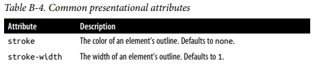

# 
 D3 for data Visualisation  Data-Driven Documents

* DOM elements are accessible in HTML (tags), CSS (selectors) and
JavaScript (nodes)  
* A D3 Selection is a wrapper object surrounding DOM nodes in JavaScript  

**Prepare your data** - Ensure data is <u>**properly ordered**</u>. An unordered dataset will create messy line charts.  
* Do this with `d3.sort(ds, attribute_to_sort_by)` method  
* With Some charts (such as bubble chart), can specify the order elements are processed to determine which elements will lie on top and which will lie behind  

---  

Many D3 **functions** use the following idiom:  
* When called **with** approrpriate arguments, these functions act as *<u>setters</u>* - setting the corresponding property to the supplied value. Many D3 setters can take an **accessor function** as an argument, which is expected to return a value that will be used to set the property in question  
* When called **without** arguments, these functions act as *<u>getters</u>* - returning the current value of the property  
* To entirely <u>*remove*</u> a property, call the appropriate setter while supplying **null** as argument  

---  

##### NOTE - 
* `d` generally used to denote "current thing" in anonymous functions. It is usually an individual data point bound to a DOM element; when working with arrays, d is an array element (as in `ds.map( d => +d )` )  
* Data sets are usually denoted `data` or `ds`  

   

* Two methods can **create selections**:  
  `d3.select(selector)` - selection with the first element matching selector  
  `d3.selectAll(selector)` - selection of all elements matching selector
* If nothing is matched, an empty selection is created  
 
* Can be **chained**:  
`mySelection.selectAll(selector)` - access descendants of the DOM node  
`mySelection.append(tag)` - lets you add a direct child to each elements
of your selection, and returns these children as a new selection  
 
* Making a selection:
  
 
* **Binding** data to elements:  
`mySelection.data(myData, key)` - method for binding myData to
elements of mySelection. `key` is an accessor to uniquely match data items to DOM elements.
  * Default key is the data indices  
  * Accessor functions essentially declare how to reach part of data objects, 
e.g., &emsp; d => d.k  
 
* **Joining** elements:  
  * Once DOM elements are bound to data entries, we have four possibilities:  
  
`mySelection.join(…)` - method that gives us access to these three
sub-selections:  
  * **enter selection**, for elements to add  
  * **update selection**, for elements to change  
  * **exit selection**, for elements to remove  
 
  * **returns** the fully updated selection (enter+update)  
  
  
Note the accessor function in the 'data' function  
By **key value**:  
  
Without accessor function, takes **objects as passed**:  
  
Adding missing elements and removing extra ones is a **default behaviour**  
`mySelection.join(tag)` - shorthand for doing so (refers to the
element that need appending)  

  

---  

#### D3 Scale  

[D3 Scale Documentation](https://github.com/d3/d3-scale)  

* Module that provides a set of constructors for scale functions (Scales data to pixels)  
* Each scale function maps from an **input domain** to an **output range**  
  
General structionr:  
`d3.scale(domain, range);`  
* Update seperately later:
&emsp;`scale.domain(newDomain);`  
&emsp;`scale.range(newRange);`  
* For:
  * **continiuouse values** `domain` and `range` are an array of two elements, the minimum and maximum values  
  * **descrete values** `domain` and `range` are an array of all possible values  
* Returns a scale function which can be used to get the value in the range given a value in the domain `scale(domainValue) -> rangeValue`  
   
**Linear Scale:**  
  
**Square Root Scale:**  
  
**Log Scale:**  
  
**Band Scale:**  
  
**Point Scale:**  
  

   

---  

#### D3 Axis  

[D3 Axis Documentation](https://github.com/d3/d3-axis)  

* Module that lets you **render the scales** created by D3 scale 
* Regardless of orientation, **axes are always rendered at the origin**. To change the position of the axis with respect to the chart, specify a transform attribute on the containing element.
&emsp;&emsp;`.attr("transform", "translate(0,30)")` (to move axis to coordinates 0,30)  
* Because the visual axis component consists of many individual SVG elements (for tick marks and labels), it should **always be created inside its own `<g>` container** - Styles and transformations applied to this parent element are inherited by all parts of the axis  

First, create an axis generator:  
`let axisGen = d3.axis(scale);`  
Then call the generator on a selection (axis DOM elements will be automatically appended):  
`selection.call(axisGen);`  
   
**Axis Bottom:**  
  
**Axis Right:**  
  
**Axis Left:**  
  
**Axis Top:**  
  

##### Customise axes:  

`axis.tickValues(valuesArray);`  
* Sets values of ticks (axis interval labels)  

`axis.tickFormat(formatter);`  
* Format the tick values to be readable (e.g. with dates, large numbers, or numbers with units)  

`axis.ticks(count);`  
* Set the number of ticks to render (with regular intervales)  

`axis.ticks(interval);`  
* Set the time intervals between ticks on a time axis  

---  

#### Array Operations  

  

---  

#### SVG - Scalable Vector Graphics  
* Markup language (XML based) for 2D vector graphics  
* Manipulated in JavaScript  
* Styled in CSS  
* HTML is for text and input, SVG is for graphics  
 
* 'svg' - always the top level element of the graphic  
  * Has width and height attributes to define the viewport  
* 'g' (for group) - aggregator element  
  * Useful to apply transformations to a set of elements  
 

#### Simple shapes  
* SVG provides explicit tags for a set of predefined simple shapes.
Each shape has a set of specific attributes that control size and posi‐
tion:  
  
 

#### Complex shapes  
**Path**:
* SVG provides a special element `path`, it only needs one attribute `d` (for draw) - value of `d` is essentially a list of commands and parameters to:  
  * Move to given coordinates  
  * Draw a line  
  * Draw a Benzier Curve  
  * Draw an elliptical arc curve  
* Downside is need to calculate value of all these parameters. Instead **consider following D3 modules**  

**D3 modules for complex shapes**  
* Data generators - Converts numbers to angles (donut chart), or cumulative numbers (staked bar chart)  
* Shape generators - Functions turning data into complex SVG paths (arcs, curves, areas, links, symbols)  
* Curve interpolators - Estimates a continuous range of values between fixed discrete points (linear, cardinal, step)  
  
  

#### Data Generators

**Pie Generator**:  

`d3.pie` module  
* Calculates angles necessary to draw a pie chart, or donut chart  
* If plan to use in conjunction with `arc generator`, should **specify angles in radians (0 at -y(12 o'clock) and positive angles proceeding clockwise)

[Properties](https://github.com/d3/d3-shape/blob/v3.1.0/README.md#pies)  

**Stack Generator**:  

`d3.stack` module  
* Calculates the cumulative values of layers, in order to create stacked displays   

[Properties](https://github.com/d3/d3-shape/blob/v3.1.0/README.md#stacks)  

 

#### Shape Generators  

**Line Generator**:  
`d3.line` module  
* Computes the path of a line going through several points  
* Main properties concern:  
  * Access and transformation of x and y values  
  * Use of a curve interpolator  
  
[Properties](https://github.com/d3/d3-shape/blob/v3.1.0/README.md#lines)  

**Arc Generator**:  
`d3.arc` module  
* Creates SVG paths representing circles arcs (for pie and donut charts)  
* Default options/properties integrate directly with the result from `d3.pie`  
* Note **angles are in radians**  
* Main properties concern:
  * Access and transformation of angle values  
  * Inner and outer radii values  

[Properties](https://github.com/d3/d3-shape/blob/v3.1.0/README.md#arcs)  

Other shape generators:
* Areas - similar to lines but fills the surface below the curve  
* Links - Bezier curves connecting a source point to a target point  
* Symbols - preset list of shapes for scatter plots  

#### Curve Interpolator  

A function that estimates a continuous range of values between fixed discrete points  

  

Often used with `d3.line` and `d3.area` to inform on the actual path a line (or curve) should take  

Offers several [presets](https://github.com/d3/d3-shape/blob/v3.1.0/README.md#curves):  
* `d3.curveBasis` & `d3.curveBundle` - B-spline interpolation  
* `d3.curveBumpX/Y` - pair-wise Bézier curves  
* `d3.curveCardinal` - Cardinal spline interpolation  
* `d3.curveNatural` - Cubic spline interpolation  
* `d3.curveStep` - Horizontal and vertical line interpolation  
* `d3.curveLinear` - pair-wise straight lines  

   

**Making a Line Chart**:
* Using `curveLinear` interpolator:    
   
* Using `curveCardinal` interpolator:  
  

**Making a Pie/Donut Chart**:  
* First transform the data to get angle values:  
  
  

#### Colours
* SVG does not have a color attribute, instead you must use **fill
and stroke**  
* The **default** value for **fill is black**; the **default** value for **stroke is none**. (This means that setting fill="none" on an element
without also updating its stroke attribute makes it invisible!)  
  

