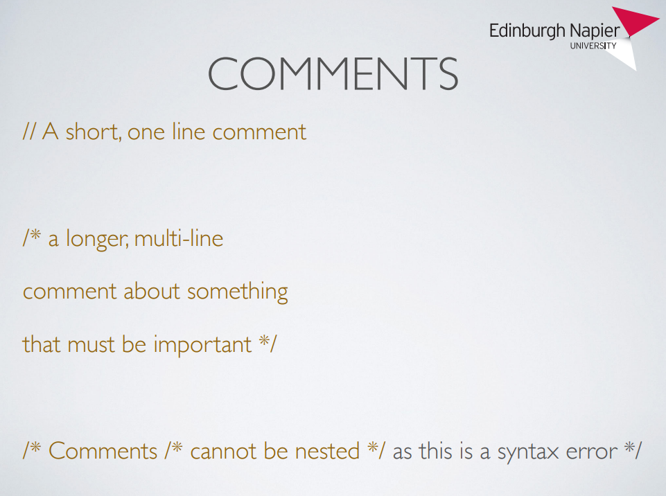
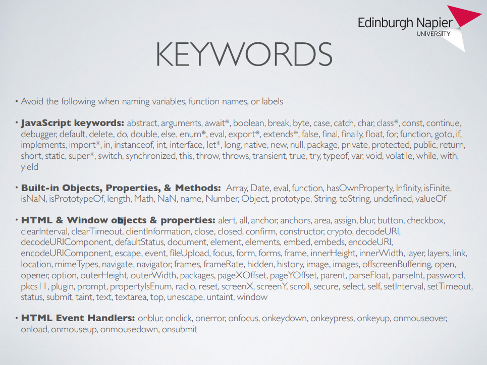
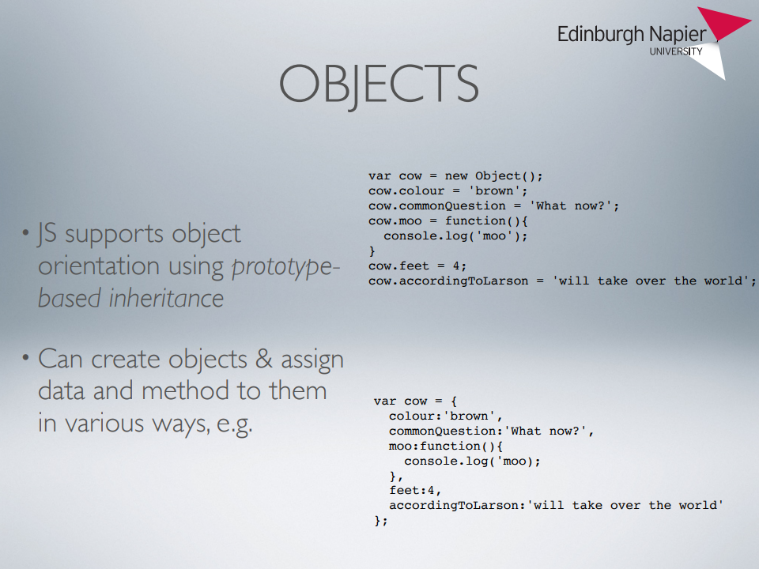
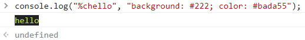
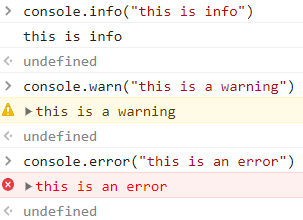
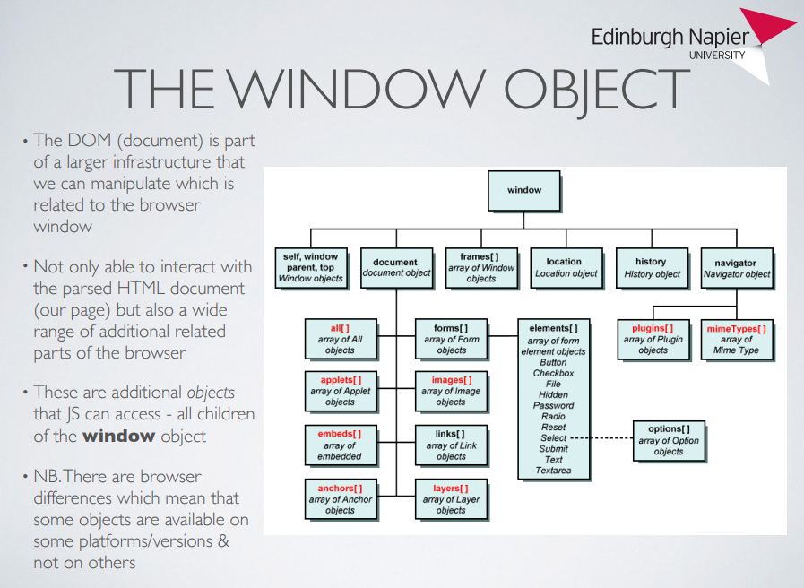
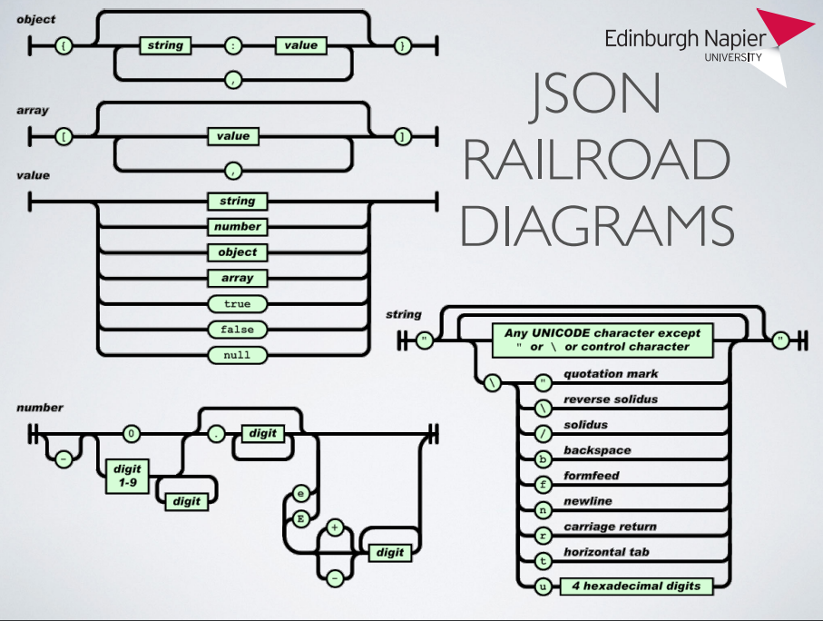

# 
 JavaScript 
  

* Used for functionality / behaviour for a web page, DOM manipulation. General purpose language  

* A **high-level, dynamic, weakly typed, prototype-based, multi-paradigm** (supports event-driven, functional, imperative, OO), **interpreted** programming language (VM based so requires environment to live in - **JS Engine**)  

* **No support** for **I/O** (generally provided by host environment)  

* There is **no single JavaScript implementation** - different engines in most web broswers meaning some features might be missing or additional in others  

---  
### JS Engines:  

* V8 - google chrome engine (also used in Node.js)  
* Spidermonkey - Firefox engine  
* JavaScriptCore - marketed as Nitro, used in Safari  
* Node.js - standalone tool to run JS outside browser enabling JavaScript to run server side  

---  
### Using JavaScript:  

* **Inline**   
&emsp;&emsp;`<button id="hellobutton" onclick="alert('Hello World')">Click Me</button>`  
* **Script block**  
&emsp;``  
    * Scripts can be placed either inside the head or body sections - however placing inside **body improves display speed** because script interpretation slows down the display  
* **External script**  
    * Call from html file (place in head or **body - recommended**):  
&emsp;&emsp;``  
    * Within js file:  
&emsp;&emsp;`function myFunction() {`  
&emsp;&emsp;&emsp;`document.getElementById("demo").innerHTML = "Paragraph changed.";`  
&emsp;&emsp;`}`  
    * Advantages of js file -  
      * Seperates HTML and code  
      * Aids readability  
      * Cached JavaSript files speed up page loads  
      * Reusuable code  
---

### Types, comments, keywords  

#### Variables can be declared:  

* **Block level** using **`let`**  
* **Function level** using **`var`**  
* **Constant** using **`const`**  
* **NO TYPE** attached, any value can be stored in any variable  
* *Value* is **undefined** until initialised  

#### Primative types:  
* **Undefined** - not initialised  
* **Null** - Declared but value is empty  
* **Number** - round with **toFixed()**  
* **String** - Access individual letters using **charAt()**, compare using **==**  
* **Boolean** - **true & false**  
* **Symbol** - unique & immutable identifier  

#### Native objects  
* **Arrays** - lists of values indexted by keys (numeric & zero based indexing)  
* **Date** - signed millisecond count from zero (representing 1970-01-01 00:00:00 UTC)  
* **Error** - Can be used to create custom error messages  
* **Math** - e.g. E, Natural Log, Pi and functions e.g. max, min, random  
* **Regular Expressions** - Store text patterns  
* **Function** - Constructed using Function constructor  

  
  

---  

#### Converting Safely Between Strings and Numbers:  
**<u>String to number:</u>**  

`Number(str)`  
* If the variable str, after stripping leading and trailing whitespace, is exactly representable as a number, then Number(str) returns a number of the represented value. If any character is encountered that cannot be converted, NaN is returned  
* Convertible are "123", " 123 ", "1.0", and "1.e3". Not convertible are "123a" and "1-2". The empty string, a string consisting only of whitespace, and the value null are converted to 0. The Boolean values true and false convert to 1 and 0, respectively  
  
`parseFloat(str)`  
* This is a global function, not a member function of an object. After stripping leading whitespace, it converts the string to an equivalent numerical value until it encounters any character that is not convertible, and returns the value up to that point. If no conversion at all took place, a value of NaN is returned. That is, "123a" converts to 123. Boolean values, the empty string, and the value null all convert to NaN  

`+str`  
* The unary prefix operator + has the same behavior as the Number() function. In arithmetic expressions, it binds tighter than other arithmetic operators: 3 * +"2" evaluates to 6. The unary prefix operator - acts like unary +, but in addition changes the sign of the numeric result. Notice that Number() is more permissive with regard to special values (such as the empty string, null, and the Booleans), but that parseFloat() is more permissive with regard to trailing nonconvertible characters. All three methods convert undefined to NaN  

**<u>Number to string:</u>**  

`String(num)`  
* Returns a string representation of its argument. Note that no string formatting is available — for example, it is not possible to restrict the number of digits to the right of the decimal point. The values null, true, and false convert to the strings "null", "true", and "false".  
  
`"" + num` or `'' + num`  
* An equivalent shorthand for `String(num)`  

`num.toString()`  
* If num is a variable, with a value that is neither null nor undefined, then the toString() member function will return a string representation of that value. Attempting to invoke `toString()` on a numeric literal (as in `1.toString()`) will lead to a syntax error, while attempting to invoke toString on null or undefined will lead to a runtime error. A receiver value of NaN is permitted and leads to the result "NaN".  
* Method `toString()` is also available on **all objects**; it is called (usually implicitly) to obtain a string representation of the object. However, its default implementation does not return a descriptive string uniquely identifying the object, but instead returns a generic constant (It is therefore not possible to use objects directly as keys in hashmaps.)  

**<u>CAUTION:</u>**  
* Never use the `Number()` or `String()` functions together with the `new` keyword. Doing so will not create primitive types (numbers or strings) but “wrapper objects” with different behavior.  
* The function `parseInt(str, radix)` converts a string to an integer, using the specified radix (which must be between 2 and 36). The function stops when encountering a nonconvertible character, hence it may give incorrect results if the string is given in exponential notation (because of the e in exponential notation).  

---  

#### Control Structures  

#### If...else  
`if (expr) {`  
&emsp;`// statements;`  
`} else if (expr2) {`  
&emsp;`// statements;`  
`} else {`  
&emsp;`// statements;`  
`}`  

#### Switch statement  
`rswitch (expr) {`  
&emsp;`case SOMEVALUE:`  
&emsp;&emsp;`// statments:`  
&emsp;&emsp;`break;`  
&emsp;`case ANOTHERVALUE:`  
&emsp;&emsp;`// statements;`  
&emsp;&emsp;`break;`  
&emsp;`default:`  
&emsp;&emsp;`// statments;`  
&emsp;&emsp;`break;`  
`}`  

#### Conditional operator  
`result = condition ? expression:`  
`alternative;`  

---  

### Loops  

#### For loop  
`for (initial; condition; loop statment) {`  
&emsp;`/*`  
&emsp;` statements will be executed every time`  
&emsp;` the for{} loop cycles, while the condition is satisfied`  
&emsp;`*/`  
`}`  

#### For In loop  
`for (var property_name in some_object) {`  
&emsp;`// statments using some_object[property_name];`  
`}`  

#### While loop  
`while (condition) {`  
&emsp;`statment1;`  
&emsp;`statment2;`  
&emsp;`statment3;`  
&emsp;`...`  
`}`  

#### Do...While loop  
`do {`  
&emsp;`statement1;`  
&emsp;`statement2;`  
&emsp;`statement3;`  
&emsp;`...`  
`} while (condition);`  

---  

### Functions  

Functions declared outside an object (and variables declared outside a function) are **global**  
Global variables and functions can be accessed via the window object as a property  

Can declare by 1 of the following:  
1. `function add(x,y) { return x + y; };`  
2. `var add = function(x,y) { return x + y; };`  
3. `var add = new Function('x','y','return x + y');`  

  
 
#### Arrow functions:  
* Simplify the definition of small anonymous functions  
* Enclose the parameters in parentheses and the function body in
braces:
`(a, b, c) => { statements }`  
* If there are no parameters, use empty parentheses:  
`() => { statements }`  

---  

#### Objects  

* The preferred way to create an object (instance) is through
an object literal:  
`var obj = { a: 1,`  
`b: [ 1, 2, 3 ],`  
 `c: function(x) { return x*x }`  
 `};`  
* Note the specific syntax of object literals (colons between key and
value, commas between different entries). A missing comma (or a
semicolon in place of a comma) can lead to obscure parsing errors 
 
* The members of an object are accessible through **dot notation and
bracket notation**. Both forms are equivalent, except that dot nota‐
tion requires the key to be a valid JavaScript identifier (a sequence of
alphanumeric characters, including _ and $, not starting with a
digit), whereas bracket notation allows any string:  
`obj.a += 2;` OR `obj["a"] += 2;`  
`obj.f(3);` OR `obj["f"](3);`  

---  

### Exception Handling  

`try {`  
&emsp;`// Statments in which exceptions might be thrown`  
`} catch(errorValue) {`  
&emsp;`// Statments that execute in the event of an exception`  
`} finally {`  
&emsp;`// Statments that execute afterward either way`  
`}`  

---  

### Best practices  

[Best practices link](https://www.w3.org/wiki/JavaScript_best_practices)

* Call things by their name - easy, short and readable variable and function names  
* Avoid globals  
* Stick to a strict coding style  
* Comment as much as needed but not more  
* Avoid mixing with other technologies  
* Use shortcut notation when it makes sense  
* Modularise - one function per task  
* Enhance progressively  
* Allow for configuration and translation  
* Avoid heavy nesting  
* Optomise loops  
* Keep DOM access to a minimum  
* Don't yield to browser whims  
* Don't trust any data  
* Add functionality with JavaScript, don't create too much content  
* Build on the sholders of giants  
* Development code is not live code  

---  

### JavaScript / HTML Events  

HTML events are **"things"** that happen to HTML elements. When JavaScript is used in HTML pages, JavaScript can **"react"** on these events  

`<element event='some JavaScript'>`  
* Can use single or double quotes, but **don't mix** (unless using within each other as below)  

Can also use within an anchor tag for example:  
`
<a href="#" onClick="alert('Hello World');">Click Me</a>
`  

#### Common HTML Events  

[Full HTML DOM Events](https://www.w3schools.com/jsref/dom_obj_event.asp)  

|Event|Description|
|:---|:---|
|onchange|An HTML element has been changed|
|onclick|The user clicks an HTML element|
|onmouseover|The user moves the mouse over an HTML element|
|onmouseout|The user moves the mouse away from an HTML element|
|onkeydown|The user pushes a keyboard key|
|onload|The browser has finished loading the page|

---  

### JavaScript Debugging  

Modern browsers have a built-in JavaScript debugger  

#### Open console  
`Ctrl + shift + I`  
**or**  
click the `3 dots` top right of browser >> `More tools` >> `Developer tools`  

Click `console` at top  

#### Log to console  
* Can be within a script:  
`console.log(variable/value);`  
* Or after an event:  
  `
<a href="#" onClick="console.log('Hello World')">Click Me</a>
` 
Pass styles to log:  
  
##### assert/trace:  
Can also use `assert()` and `trace()` to debug 
##### time:  
Time with `console.time('label')` (time can be replaced with `timeLog('label', 'data')` or `timeEnd('label')` )  
##### count:  
`console.count()` can be used in a function, option to pass a variable as parameter  

#### Errors, warnings and info  
Can log errors, warnings and info as follows:  
  

#### Set breakpoint  
keyword **debugger** stops executing before it executes the following lines of code  
`let x = 15 * 5;`  
`debugger;`  
`document.getElementById("demo").innerHTML = x;`  

---  

### The Window Object  
Represents an open browser window which contains a DOM document  
Global object, always in scope or has "global scope"  

  

Global variables and functions can be accessed via the window object as a property  e.g.:  
`var daka = “more daka”;`  
`daka === window.daka;`  
`// This will evaluate to true if the daka variable is available via the window object`  

`function hi() {console.log(“hi”);}`  
`window.hi === hi;`  
`// Will evaluate to true for the same reasons as above`  

---  

### Client-Side Storage  

#### Cookies  
* Designed for maintaining information about **state**  
* Can be used to recored activity (where clicked, credentials/log-in status, history)  
* A single string transmitted in HTTP headers during client-server communication  

Create:  
`document.cookie = "username=Andy";`  

Retrieve:  
* Store in a variable  
`var x = document.cookie;`  

Update:  
* Overwrite existing cookie  
* `document.cookie = "username=Andrew";`  

Delete:  
* Don't explicitly delete, just set expiry parameter  
`document.cookie = "username=; expires=Thu, 01 Jan 1970 00:00:00 UTC; path=/;";`  

#### DOM Storage  
* Uses browsers global variables (sessionStorage & localStorage)  
* Only stores strings (other datatypes automatically converted to strings)  
* Single strings can be limiting, so better to turn JSON object into string and then store  
* **MUST CHECK** if web storage is supported by browser first when using (try/catch, add test item, remove test item, return true)

##### sessionStorage -  
* Per origin/window/tab, limited to **lifetime of window**  
* Enables separate instances of same web application to run in different windows without intefering with each other  

Store value for rest of session:  
`sessionStorage.setItem('key','value');`  

Retrieve value:  
`alert(sessionStorage.getItem('key'));`  

##### localStorage -  
* Per origin (combination of protocol, hostname, port number)  
* Availiable to all scripts loaded from pages with the same origin  
* **Persistent** after browser closes  

Store value beyond current session:  
`localStorage.setItem('key','value');`  
OR  
`localStorage.setItem('key',JSON.stringify({name:'value'}));`  

Retrive value:  
`alert(localStorage.getItem('key'));`  
OR  
`alert(JSON.parse(localStorage.getItem('key')).name);`  

#### Indexed DB  
* Recommended standard for a low-level browser API for client-side storage of a local, transactional database  
* Enables sites to "permanently" collect and save large amounts of structured data  
* NoSQL storage - JSON object collections with indices  
* Aimed at browser implemented functions (such as bookmarks) and web applications (like email clients)  
* **OVERKILL** for many use cases where DOM storage or alternatives are more appropriate  

---  

### JSON (Java Script Object Notation)  
* Standard for describing data - though not for general purpose (use for specific tasks)  
* Often used to send and recieve data from web-apps  
* Can **only** be in string format  

#### JSON string  
* JavaScript objects can be converted into JSON which is stored as a string  
* JSON data is represented:  
  * In key/value pairs  
  * Separated by commas  
  * Curly braces hold objects  
  * Square brackets hold arrays  

* **Keys** must be **strings** in double quotes  
* **Values** must be either:  
  * Strings  
  * Numbers  
  * An object  
  * An array (can contain lists of dictionaries)  
  * A boolean  
  * null  

##### Stringify:
Convert JS object to JSON string:  
`obj = {name: "John", age: 30, city: "New York"};`  
`myJSON = JSON.stringify(obj);`  

Convert array to JSON string:  
`arr = ["John", "Peter", "Sally", "Jane"];`  
`myJSON = JSON.stringify(arr);`  

##### Parse:  
Convert JSON string to JS object:  
Recieve example JSON string as:  
`'{"name":"John", "age":30, "city":"New York"}'`  
`obj = JSON.parse('{"name":"John", "age":30, "city":"New York"}');`  
OR when contains array:  
Example JSON string:  
`text = '["Ford", "BMW", "Audi", "Fiat"]';`  
`myArr = JSON.parse(text);`  

  

---  

